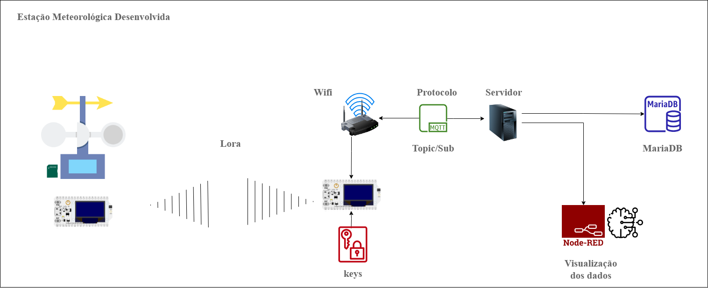

# Estação Meteorológica Inteligente

Este repositório contém os arquivos desenvolvidos para a criação de uma estação meteorológica, baseada na tecnologia LoRa (Long Range) e MQTT. Este projeto tem como objetivo a construção de uma Estação Meteorológica Inteligente, equipada com um sistema redundante de coleta de dados, capaz de armazenar informações tanto localmente quanto em um banco de dados seguro, tornando-o aplicável em ambientes remotos.

## Funcionamento Geral

A estação é composta por dois microcontroladores em comunicação ponto a ponto. Um dos microcontroladores fica instalado na estação, em uma área remota, sendo responsável pelo processamento e transmissão dos dados coletados pelos sensores. O outro microcontrolador permanece em area com acesso a internet, encarregado de receber os dados enviados pela estação.

A transmissão dos dados ocorre periodicamente por meio de uma conexão sem fio entre a estação e o receptor. Esse receptor, além de receber os pacotes de dados, realiza o encaminhamento das mensagens recebidas para o banco de dados MariaDB e para um sistema supervisório desenvolvido no Node-RED.
## Principais Características

- Implementação de uma topologia ponto a ponto, permitindo a transmissão bidirecional de dados entre os dispositivos envolvidos no sistema.
- Código-fonte completo e bem documentado do ESP que atua como o nó emissor, responsável por coletar informações meteorológicas a partir de sensores e transmiti-las por meio da rede LoRa.
- Código-fonte detalhado do ESP que desempenha o papel de nó receptor, recebendo os dados LoRa e enviando-os para uma aplicação de monitoramento.
- Arquivo exportado em formato JSON do Node-RED contendo a configuração dos nós do sistema, bem como a estilização personalizada para uma visualização intuitiva dos dados coletados.

## Componentes do Projeto

1. Arquivos ESP:
   - "esp_labcam_emissor.ino": Código do ESP nó emissor que coleta dados dos sensores e transmite-os através da rede LoRa.
   - "esp_labcam_receptor.ino": Código do ESP nó receptor que recebe os dados LoRa e os encaminha para a aplicação de monitoramento.

2. Arquivo JSON do Node-RED:
   - "configuracao_node_red.json": Arquivo JSON que contém a configuração dos nós do Node-RED, incluindo o tratamento dos dados recebidos e a interconexão com o protocolo MQTT.
   - "css.json": Arquivo JSON que contém a estilização personalizada da interface gráfica do Node-RED para visualização dos dados climáticos em tempo real.
     
## Recursos Adicionais

- Cálculo de Eto (Evapotranspiração de Referência) - ✔️
- Utilização de modelos de aprendizado de máquina para previsões meteorológicas - 🚧
- Monitoramento contínuo dos dados coletados - ✔️

Sinta-se à vontade para contribuir com melhorias e feedbacks neste projeto! Qualquer ajuda é bem-vinda.
